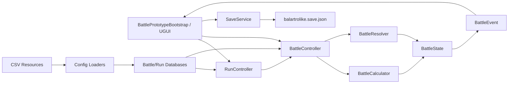

# 《卦锻》架构与功能说明

> 版本：v1.0｜更新：2026-09-09｜适用：当前 `main` 分支的 MVP 可玩原型
>
> 本文描述“当前已经落地”的实现，并对目标架构、未接线能力和后续扩展边界做明确标注。若本文与代码不一致，以代码和对应模块文档为准。

## 1. 文档定位

本文用于回答四个问题：

1. 当前工程由哪些模块组成，模块之间如何依赖。
2. 玩家从启动游戏到完成一局的运行时流程是什么。
3. 战斗、局内、配置、存档和 UI 分别承担什么职责。
4. 后续增加卡牌、卦象、法宝、敌人、节点或替换 UI 时，应该从哪里扩展。

本文不是完整玩法策划，玩法规则以 `docs/design/核心玩法策划.md` 和 `docs/design/模块文档/` 为准；程序实现细节以 `Assets/Scripts/` 和 `docs/program/` 下的专项文档为准。

## 2. 当前工程快照

### 2.1 技术基线

| 项目 | 当前值 | 说明 |
|---|---|---|
| Unity | `2022.3.62f3c1` | 当前工程版本，不升级 Unity 6 |
| 渲染 | URP `14.0.12`，2D Renderer | 当前原型主要使用 UGUI 和 2D 渲染配置 |
| 语言 | C# | 战斗、局内、存档核心为普通 C# 类 |
| UI | UGUI | 当前原型使用 `UnityEngine.UI.Text`、`Button`、`LayoutGroup`、`CanvasGroup` |
| 输入 | 旧 Input Manager | 当前使用 `StandaloneInputModule`，尚未接入 Input System |
| 配置 | CSV + `Resources` | 运行时由 Loader 解析为只读 Definition/Database |
| 存档 | JSON | `DataContractJsonSerializer` + `Application.persistentDataPath` |
| 测试 | Unity Test Framework | 现有测试集中在 `Assets/Tests/EditMode/` |
| 目标分辨率 | 1920×1080 | 原型按 16:9 设计，最低需验证 1280×720 |

### 2.2 当前实现形态

当前工程仍是“单场景 + 运行时构建 UI”的可玩原型，而不是最终生产结构：

- `BattlePrototypeBootstrap` 通过 `RuntimeInitializeOnLoadMethod` 自动创建，负责加载配置、构建 UGUI、切换页面和处理玩家输入。
- 当前没有独立的 `Boot`、`MainMenu`、`Battle` 场景；入口场景仍是 `Assets/Scenes/SampleScene.unity`。
- 当前没有正式 UI Prefab；Canvas、面板、按钮和文本由 `BattlePrototypeBootstrap.BuildUi()` 在运行时创建。
- 当前 UI 使用 legacy UGUI `Text`，不是 TextMeshPro。生产 UI 的目标方案是 Prefab + TextMeshPro，但尚未接入。
- 战斗、局内和存档核心不依赖 UnityEngine UI；这些类可以独立编译和做 EditMode 测试。
- `BattlePrototypeBootstrap` 目前同时承担“组合根、流程控制器和临时视图”三种职责，这是原型阶段的刻意简化，不是长期架构。

### 2.3 已完成能力

| 能力 | 当前状态 |
|---|---|
| 八卦与 64 卦 | 8 种八卦、8×8 组合查询、内卦/外卦顺序规则已实现 |
| 战斗回合 | 玩家回合、出卦、弃牌、符箓、结束回合、敌人行动和胜负判定已实现 |
| 伤害计算 | 预览与执行共用 `BattleCalculator`，使用万分比定点整数 |
| 五行 | 克制、被克、同属性系数已实现 |
| 武器 | 基础力道、攻击模式、连击数、五行亲和已接入 |
| 状态 | `StatusInstance` 容器和基础状态结算已接入 |
| 附魔 | 3 槽 FIFO、剩余回合和 UI 展示已接入 |
| 法宝 | `BeforeDamage`、`AfterPlay` 触发和条件系统已接入 |
| 符箓 | 一次性使用、效果校验、战斗内与局内列表同步已接入 |
| 敌人意图 | `Sequence`、`Weighted`、条件、冷却和 `StatusImmune` 已接入 |
| 局内循环 | 路线、战斗结果、坊市、奇遇、晋升、本局结算已接入 |
| 天劫 | 天劫等级选择、敌人/坊市修正和解锁已接入 |
| 图鉴与熟练度 | 64 卦图鉴、使用次数和熟练度加成已接入 |
| 存档 | 局外、局内、战斗快照、自动保存、备份和继续游戏已接入 |
| 战斗反馈 | 可斩杀提示、出卦/符箓/回合结算浮层和基础动画已接入 |
| 自动化测试 | 战斗、局内、存档 EditMode 测试已落地 |

## 3. 总体架构

### 3.1 架构图



### 3.2 分层职责

| 层 | 主要类型 | 职责 | 是否依赖 Unity |
|---|---|---|---|
| 启动与表现层 | `BattlePrototypeBootstrap`、`BattleFeedbackView` | 构建 UI、接收输入、显示状态、播放反馈、自动保存 | 是 |
| 战斗领域层 | `BattleController`、`BattleCalculator`、`BattleResolver`、`BattleState` | 战斗状态机、命令校验、伤害计算、结算和事件生成 | 否 |
| 局内领域层 | `RunController`、`RunState`、`RunMetaProgressState` | 路线、奖励、坊市、奇遇、晋升、天劫和局外进度 | 否 |
| 配置层 | `CsvBattleConfigLoader`、`CsvRunConfigLoader`、各 Database | 将 CSV 解析为只读 Definition/Database | 加载入口使用 Unity `Resources` |
| 存档层 | `SaveService`、`SaveFileStorage`、`GameSaveData` | 采集、序列化、恢复和备份存档 | 否 |
| 测试层 | `BattleCoreTests`、`RunCoreTests`、`SaveCoreTests` | 验证纯逻辑规则和存档恢复 | Unity Test Framework |

### 3.3 依赖规则

必须遵守以下边界：

- UI 只发送命令和展示结果，不自行计算伤害、五行、法宝或状态收益。
- `BattleCalculator` 只读状态，不修改 `BattleState`。
- `BattleResolver` 负责修改状态并生成 `BattleEvent`，不直接操作 UI。
- `RunController` 负责跨战斗的局内状态，不承担战斗内部结算。
- CSV 只保存静态定义，不保存当前 HP、手牌、状态层数、敌人意图或随机数状态。
- 战斗结束只把明确的结算结果写回 `RunState`，不把整个战斗对象带入下一场战斗。
- 未实现能力必须标记 `TODO`，不能由 UI 或假数据伪造结果。

## 4. 启动与总流程

### 4.1 启动链路

```text
Unity 加载场景
  ↓
BattlePrototypeBootstrap.AutoCreate()
  ↓
Awake()
  ├─ ResourcesBattleConfigLoader.LoadIfNeeded()
  ├─ ResourcesRunConfigLoader.LoadIfNeeded()
  ├─ BuildUi()
  └─ ShowMainMenu()
```

`BuildUi()` 当前创建：

- `EventSystem` + `StandaloneInputModule`
- Screen Space Overlay `Canvas`
- `CanvasScaler` 和 `GraphicRaycaster`
- 主菜单、路线、战斗、结算、坊市、奇遇、晋升、图鉴和局外进度等根节点
- 动态手牌、符箓、路线节点和商店商品按钮

### 4.2 一局主流程

```text
主菜单
  ├─ 开始修行 → RunController.CreatePrototype()
  └─ 继续游戏 → SaveService.TryLoad() → SaveService.TryRestore()

路线页
  ↓ 选择武器、进入当前节点
战斗
  ↓
战斗结果
  ├─ 胜利 → 获得灵石、标记节点完成、进入下一节点
  ├─ 渡劫胜利 → 境界晋升
  └─ 失败 → 本局结算
坊市 / 奇遇
  ↓
下一节点 / 晋升 / 本局结算
  ↓
局外进度
  ├─ 道行
  ├─ 天劫解锁与选择
  └─ 64 卦使用次数
```

### 4.3 战斗状态机

| 状态 | 含义 |
|---|---|
| `BattleStart` | 初始化牌堆、玩家、敌人、意图和随机种子 |
| `PlayerTurnStart` | 恢复灵力、摸牌、处理回合开始效果 |
| `PlayerAction` | 等待玩家出卦、弃牌、使用符箓或结束回合 |
| `Resolving` | 正在执行一个玩家指令，期间禁止继续输入 |
| `EnemyTurn` | 执行敌人当前意图、状态结算和下一意图选择 |
| `BattleEnd` | 战斗已结束，停止输入并输出结果 |

### 4.4 局内状态机

| 状态 | 含义 |
|---|---|
| `Map` | 路线页，等待进入当前节点 |
| `Battle` | 当前正在战斗 |
| `BattleResult` | 战斗结算展示，等待确认 |
| `RealmPromotion` | 渡劫胜利后的境界晋升 |
| `Shop` | 坊市页面 |
| `Event` | 奇遇页面 |
| `RunResult` | 本局胜利或失败结算 |
| `MetaProgress` | 局外进度页面 |

## 5. 战斗系统

### 5.1 核心对象

| 类型 | 职责 |
|---|---|
| `BattleState` | 保存一场战斗的完整运行时状态 |
| `BattleController` | 对外提供命令接口并驱动状态机 |
| `BattleCalculator` | 计算一次出卦的结果，不修改状态 |
| `BattleResolver` | 将计算结果应用到状态并生成事件 |
| `BattleCalculation` | 一次出卦的完整计算结果 |
| `DamageBreakdown` | 伤害明细，用于预览、结算、详情和测试 |
| `BattleEvent` | 逻辑层向表现层传递的事实 |
| `CardInstance` | 手牌、抽牌堆和弃牌堆中的运行时卡牌 |
| `PlayerState` / `EnemyState` | 玩家和敌人的生命、护盾、能量和状态 |
| `WeaponState` | 武器运行时数据和附魔槽 |
| `StatusInstance` | 状态层数和剩余回合 |
| `EnchantInstance` | 附魔来源、效果和剩余回合 |
| `HexagramDefinition` | 一组内外卦组合的静态定义 |
| `EnemyIntent` | 敌人当前意图的运行时快照 |

`BattleState` 当前保存：

- 随机种子、回合数、战斗阶段和战斗结果
- 玩家 HP、护盾、灵力、最大灵力、每回合灵力
- 武器运行时数据、攻击模式、连击数和附魔槽
- 抽牌堆、弃牌堆和手牌
- 法宝和符箓列表
- 敌人 HP、护盾、五行、意图和状态
- 战斗事件列表和 64 卦使用次数

### 5.2 玩家命令

`BattleController` 对外提供：

```text
StartBattle()
PreviewPlay(innerCardUid, outerCardUid)
PlayHexagram(innerCardUid, outerCardUid)
DiscardCards(cardUids)
UseTalisman(index)
EndTurn()
```

命令处理原则：

- 先校验阶段、资源、卡牌和索引是否合法。
- 校验失败返回 `BattleCommandResult.Fail()`，不修改状态。
- 预览只调用 `BattleCalculator`，不消耗手牌和灵力。
- 执行前重新计算，避免使用过期的预览结果。
- 成功执行后由 `BattleResolver` 修改状态并追加事件。

### 5.3 伤害计算

当前 `BattleCalculator` 使用万分比整数计算，`10000` 表示 `1.0`，避免浮点显示误差。

计算顺序：

```text
基础伤害 = 武器基础力道 + 内卦牌卦力 + 外卦牌卦力

原始伤害 =
    基础伤害
    × 武器五行亲和
    × 卦象倍率
    × 熟练度倍率
    × 五行倍率
    × 法宝加法乘区
    × 法宝乘法乘区
    × 状态倍率
    × 会心倍率

最终伤害 = 原始伤害 - min(敌方护盾, 原始伤害)
```

当前明确使用的倍率：

| 乘区 | 当前规则 |
|---|---|
| 武器五行亲和 | 内卦五行与武器亲和一致时 `×1.25` |
| 卦象倍率 | 内外卦模板倍率，特殊卦可覆盖 |
| 熟练度 | 图鉴熟练度达到精通后提供 `×1.20` |
| 五行 | 克制 `×1.5`，被克 `×0.67`，普通 `×1.0`，对敌同属性 `×0.85` |
| 法宝 | 先合并加法乘区，再应用乘法乘区 |
| 状态 | 易伤增加伤害，虚弱降低伤害 |
| 会心 | 满足必定会心条件时 `×1.5` |
| 防御 | 当前按敌方护盾吸收 |

连击规则：

```text
实际段数 = 武器 HitCount × 内卦 InnerHitCount
```

每次命中分别扣除护盾和 HP。`AllTargets` 目前只保留配置和计算标记，多敌人目标列表尚未接入。

### 5.4 出卦结算顺序

`BattleResolver.ResolvePlay()` 当前顺序：

1. 从手牌移除内卦和外卦。
2. 消耗灵力。
3. 记录卦象形成事件。
4. 记录该卦使用次数。
5. 按段数结算伤害和护盾。
6. 执行卦象即时效果。
7. 将带持续时间的卦象效果写入武器附魔槽。
8. 触发满足条件的 `AfterPlay` 法宝。
9. 将两张牌放入弃牌堆。
10. 增加本回合出卦次数。
11. 检查战斗是否结束。

### 5.5 状态、附魔、法宝和符箓

**状态**

- `StatusInstance` 统一保存状态 ID、层数和剩余回合。
- 当前伤害链路明确接入易伤和虚弱。
- 回合结算接入灼烧。
- 护盾作为独立资源处理。
- `ArmorBreak`、`Chill` 等枚举和数据入口已预留，完整效果需要在后续效果操作中补齐。

**附魔**

- 只写入 `Duration > 0` 的持续效果。
- 最多 3 个槽。
- 槽满时按先入先出替换最旧附魔。
- 在玩家回合开始时递减剩余回合。
- 附魔槽负责 FIFO、计时和 UI，不重复执行本手即时效果。

**法宝**

- `BeforeDamage`：通过 `ArtifactRules.CollectDamageModifiers()` 汇总进伤害计算。
- `AfterPlay`：在出卦即时效果和附魔写入后触发。
- 当前支持 `Always`、`FirstPlayEachTurn`、`InnerElement`、`Hexagram` 条件。
- `PlaysThisTurn` 在玩家回合开始清零，每次成功出卦后递增。

**符箓**

- 只允许在 `PlayerAction` 阶段使用。
- 使用前校验效果是否能生效。
- 抽牌类符箓在手牌已满或抽牌堆为空时不会消耗。
- 成功后执行全部效果、发送 `TalismanUsed`，并从战斗内和本局符箓列表移除。
- 当前暂不支持目标选择。

### 5.6 敌人意图

敌人 AI 使用配置化意图池，不使用行为树：

- `Sequence`：按 `intentIds` 顺序循环，不满足条件的意图跳过。
- `Weighted`：按权重使用战斗种子随机选择，重复运行结果一致。
- 支持 `Always`、`HpBelow`、`HpAbove`、`TurnAtLeast` 条件。
- `cooldown` 以回合差判断。
- 选择结果保存到 `EnemyState.CurrentIntent`，UI 只展示当前运行时意图。
- 当前 Boss 规则只实现 `StatusImmune`；其他 Boss 规则后续通过独立 Modifier 扩展。

### 5.7 逻辑与表现桥接

`BattleEvent` 是逻辑层和表现层之间的唯一桥梁。当前事件类型包括：

- 战斗开始、玩家回合开始
- 抽牌、弃牌、形成卦象
- 伤害、护盾、状态、灵力变化
- 敌人意图变化、敌人行动
- 法宝触发、符箓使用
- 战斗结束

事件必须携带足够的信息独立表达“发生了什么”。当前原型会读取事件文本并刷新界面，`BattleFeedbackView` 负责播放单条浮层反馈；完整的逐事件动画队列、伤害数字、屏幕震动和粒子表现仍在后续阶段。

### 5.8 当前战斗限制

- 当前只支持单敌人结算；`AllTargets` 尚未接入目标列表。
- 抽牌效果暂不重洗弃牌堆。
- 符箓不支持目标选择。
- Boss 规则只实现状态免疫。
- 部分状态枚举已预留，但完整效果和触发时机仍需补齐。
- 战斗事件到 UI 的完整动画队列尚未完成。
- 当前战斗 UI 是原型层，不能作为生产 UI 结构直接复用。

## 6. 单局系统

### 6.1 `RunState`

`RunState` 保存跨战斗的一局数据：

- 随机种子、当前节点索引、局内阶段和结果
- 灵石、待结算奖励和局外道行奖励
- 最大生命加成、武器威力加成和天劫等级
- 当前武器 ID
- 牌组、法宝列表和符箓列表
- 已完成节点、当前坊市和奇遇状态
- 当前商店商品和已购买商品

### 6.2 路线与节点

- 节点由 `run_nodes.csv` 配置，按顺序推进。
- 当前节点类型包括普通战斗、精英战斗和渡劫战斗。
- 路线页显示已完成、当前和未解锁节点。
- 进入节点后根据节点配置选择敌人、战斗修正和奖励。
- 当前原型配置覆盖 9 个节点，跨 3 个境界；具体内容以 CSV 为准。

### 6.3 战斗结果与奖励

- 战斗胜利后进入 `BattleResult`，由玩家确认。
- 胜利增加节点灵石奖励并标记节点完成。
- 渡劫战斗胜利后进入 `RealmPromotion`。
- 战斗失败后进入 `RunResult`。
- 本局结算会把道行奖励写回 `RunMetaProgressState`。
- 只有明确的结算数据会写回局内状态，战斗临时对象不会直接带入下一场。

### 6.4 坊市

`RunController` 负责：

- 生成和刷新商店商品。
- 校验灵石、商品状态和拥有上限。
- 支持购买法宝、符箓、牌组内容和删牌等效果。
- 保存当前商品列表、刷新次数和已购买列表。
- 商品价格受当前天劫修正影响。

### 6.5 奇遇

- 奇遇由 `run_event_options.csv` 配置选项和效果。
- `RunState` 保存当前奇遇 ID、是否已解决和结果文本。
- 奇遇效果通过统一的 `RunEffectType` 和局内效果模型应用。
- 当前奇遇主要覆盖牌组、灵石、生命和资源变化。

### 6.6 晋升、天劫与局外成长

- 渡劫节点胜利后根据 `run_realms.csv` 进入晋升阶段。
- 天劫配置位于 `run_tribulations.csv`，影响敌人生命、敌人威力和商店价格。
- 局外状态 `RunMetaProgressState` 保存：
  - 道行
  - 最高天劫等级
  - 当前选择的天劫等级
  - 完成局数
  - 64 卦使用次数

### 6.7 当前局内限制

- 节点内容仍是原型池，后续需要继续扩充。
- 奇遇、坊市和晋升页面当前由同一个运行时 UI 根节点切换，不是独立场景。
- 多敌人和复杂 Boss 机制尚未接入。
- 完整的局外解锁树和长期养成系统尚未展开。

## 7. 数据配置

### 7.1 配置加载链

```text
CSV 文件
  ↓
ResourcesBattleConfigLoader / ResourcesRunConfigLoader
  ↓
CsvBattleConfigLoader / CsvRunConfigLoader
  ↓
BattleConfigDatabase / RunConfigDatabase / RunEncounterDatabase
  ↓
Definition / Database 只读查询
```

当前配置目录：

```text
Assets/Resources/Config/Battle/
  artifacts.csv
  battle_default.csv
  deck.csv
  enemies.csv
  enemy_intents.csv
  hexagrams.csv
  talismans.csv
  trigrams.csv
  weapons.csv

Assets/Resources/Config/Run/
  run_encounters.csv
  run_event_options.csv
  run_nodes.csv
  run_realms.csv
  run_shop_offers.csv
  run_tribulations.csv

Assets/Resources/Config/UI/
  battle_feedback_animation.csv
```

### 7.2 配置与运行时分离

| 类型 | 用途 |
|---|---|
| CSV | 静态内容、数值、文本和引用 |
| Definition | 只读配置对象 |
| Database | ID 查询和配置索引 |
| RuntimeState | 单场战斗或单局运行状态 |
| Save DTO | 存档序列化和版本迁移 |

CSV 禁止保存当前 HP、当前手牌、状态层数、敌人意图、附魔剩余回合或随机数状态。

### 7.3 效果配置

多个效果使用 `;` 分隔，单个效果格式为：

```text
EffectType|EffectTarget|ValueType|Value|StatusId|Stacks|Duration
```

示例：

```text
GainShield|Self|Flat|2|None|0|0
ApplyStatus|Enemy|Stacks|2|Burn|2|2
DrawCard|Self|Count|1|None|0|0
```

原则：

- 一个 `EffectOperation` 只做一件事。
- 复杂效果通过有序操作列表组合。
- 特殊卦只覆盖明确字段，不在 `BattleCalculator` 中按卦 ID 写分支。
- 新内容优先扩展 CSV 和效果模型，不复制新的战斗类。

### 7.4 ID 规范

- 八卦：`qian`、`dui`、`li`、`zhen`、`xun`、`kan`、`gen`、`kun`
- 卦象：`{outerTrigram}_{innerTrigram}`
- 武器：`weapon_*`
- 法宝：`artifact_*`
- 符箓：`talisman_*`
- 敌人：`enemy_*`
- 状态：`status_*`

卦象 ID 必须明确“上卦在前、下卦在后”，例如 `kun_qian` 和 `qian_kun` 是不同卦象。

## 8. 存档与继续游戏

### 8.1 存档结构

`GameSaveData` 分为三层：

```text
GameSaveData
  ├─ MetaSaveData
  │   ├─ 道行
  │   ├─ 天劫最高/当前等级
  │   ├─ 完成局数
  │   └─ 64 卦使用次数
  ├─ RunSaveData
  │   ├─ 路线、节点、灵石和阶段
  │   ├─ 牌组、武器、法宝和符箓
  │   └─ 坊市、奇遇和晋升状态
  └─ BattleSaveData
      ├─ 回合、阶段和结果
      ├─ 玩家、敌人和武器状态
      ├─ 抽牌堆、手牌、弃牌堆
      └─ 状态和附魔
```

### 8.2 文件策略

- 路径：`Application.persistentDataPath/balartrolike.save.json`
- 版本：`SaveService.CurrentVersion`
- 写入：先写 `.tmp`，再通过 `File.Replace` 生成 `.bak`
- 读取：主文件失败时尝试 `.bak`
- 序列化：`DataContractJsonSerializer`
- 战斗恢复：恢复到玩家回合开始的安全边界，避免重复结算

### 8.3 自动保存

当前原型在以下节点自动保存：

- 开始新局、选择武器和进入战斗
- 出卦、使用符箓、结束回合
- 战斗结算、晋升和局内结算
- 坊市购买、刷新和离开
- 奇遇选择和离开
- 局外进度变化

### 8.4 当前限制

- 存档版本迁移目前只有版本号检查，没有完整迁移器。
- 旧版本存档会拒绝加载，后续需要按版本补充迁移函数。
- 当前存档包含战斗快照，但恢复边界仍以玩家回合开始为主。
- 加密、云同步和多存档槽尚未接入。

## 9. UI 与表现

### 9.1 当前原型 UI

当前 UI 由 `BattlePrototypeBootstrap` 运行时构建，主要页面包括：

- 主菜单
- 路线页
- 战斗 HUD
- 战斗结果
- 坊市
- 奇遇
- 境界晋升
- 本局结算
- 局外进度
- 图鉴

战斗 HUD 当前包含：

- 顶部状态文本
- 卦象预览
- 战斗日志
- 手牌区
- 法宝/符箓区
- 出卦、回合结束、继续和重新开始按钮
- 战斗反馈浮层

### 9.2 `BattleFeedbackView`

`BattleFeedbackView` 是基于 UGUI 的反馈组件：

- 使用 `Text` 显示提示。
- 使用 `RectTransform` 控制上浮、缩放和抖动。
- 使用 `CanvasGroup` 控制淡出。
- 使用协程播放动画。
- 动画结束后回调，恢复战斗输入。
- 动画参数来自 `Assets/Resources/Config/UI/battle_feedback_animation.csv`。

当前支持的效果包括：

- 可斩杀提示
- 出卦反馈
- 符箓使用反馈
- 回合结算反馈
- 输入锁定与播放完成回调

### 9.3 目标 UI 方案

生产 UI 的目标方案是：

- Prefab 化页面和组件。
- TextMeshPro 替换 legacy `Text`。
- `BattleView` 独立于 `BattlePrototypeBootstrap`。
- 事件队列逐条播放，而不是只刷新文本。
- 伤害数字、状态图标、飞行卡牌和屏幕特效使用独立 Animation Layer。
- 输入层统一转换为战斗命令，UI 不直接修改状态。

### 9.4 当前 UI 限制

- 当前不是 Prefab，运行时节点名称和层级仍由代码决定。
- 当前使用 legacy UGUI Text，不适合作为最终排版和字体方案。
- 动态手牌、符箓和商品按钮仍是运行时创建。
- 完整事件队列、伤害数字和可跳过动画尚未接入。
- 手柄导航和 Input System 尚未接入。

## 10. 测试与质量

### 10.1 测试范围

现有 EditMode 测试分为三组：

| 测试文件 | 覆盖内容 |
|---|---|
| `BattleCoreTests.cs` | 64 卦、五行、伤害、预览、状态、附魔、法宝、符箓、敌人意图和胜负 |
| `RunCoreTests.cs` | 路线、奖励、坊市、奇遇、晋升、天劫和局内结算 |
| `SaveCoreTests.cs` | 存档采集、序列化、恢复、备份和战斗快照 |

重点断言：

- 8×8 共 64 个卦象组合全部可生成。
- 内卦和外卦顺序不同会生成不同卦象。
- 预览不修改战斗状态。
- 预览伤害与实际结算一致。
- 五行克制、被克和同属性系数正确。
- 法宝加算先于乘算。
- 附魔槽满时按 FIFO 替换。
- 符箓无法生效时不消耗。
- 敌人意图与执行结果一致。
- 存档恢复后不重复结算战斗。

### 10.2 编译与验证

代码改动后至少执行：

```powershell
dotnet build .\BalartroLike.sln -v:minimal
```

然后在 Unity Test Runner 中运行 EditMode 测试，并手动验证：

- 主菜单开始新局和继续游戏。
- 路线页节点推进。
- 完整战斗回合。
- 战斗结果写回。
- 坊市购买和奇遇选择。
- 晋升和本局结算。
- 存档后重新进入。
- 快速连续点击不会重复结算。

### 10.3 完成定义

一个功能只有同时满足以下条件才算完成：

- Unity 编译通过。
- EditMode 测试通过。
- 手动流程通过。
- 未修改无关模块。
- 未手改 `.meta` 和 `UI/Gen/**`。
- 未实现能力有明确 `TODO`。
- 文档与实现一致。
- 规则计算没有进入 UI。
- 没有引入不必要的第三方依赖。

## 11. 扩展指南

### 11.1 新增八卦或卦象

1. 在 `trigrams.csv` 增加或修改八卦定义。
2. 在 `hexagrams.csv` 增加特殊卦覆盖，未覆盖字段继续使用内卦/外卦模板。
3. 若新增效果，先确认 `EffectType`、`EffectTarget` 和 `ValueType` 已支持。
4. 增加配置加载和战斗计算测试。
5. 不在 `BattleCalculator` 中写卦 ID 分支。

### 11.2 新增法宝或符箓

1. 在 `artifacts.csv` 或 `talismans.csv` 增加内容。
2. 选择正确的触发时机和条件。
3. 使用统一的 `EffectOperation` 描述效果。
4. 确认预览路径（法宝）或使用前校验路径（符箓）。
5. 增加触发顺序、消耗和失败不消耗测试。

### 11.3 新增敌人

1. 在 `enemies.csv` 增加敌人定义。
2. 在 `enemy_intents.csv` 增加意图。
3. 选择 `Sequence` 或 `Weighted` 模式。
4. 配置条件、冷却和显示文本。
5. 验证当前意图与实际行动一致。

### 11.4 新增节点、坊市或奇遇

1. 在对应 CSV 增加配置。
2. 通过 `RunController` 增加命令和校验，不直接修改 `RunState`。
3. 添加存档字段和恢复逻辑。
4. 更新运行时 UI 的刷新和输入锁定。
5. 增加 EditMode 测试。

### 11.5 替换原型 UI

推荐按以下顺序迁移：

1. 保留 `BattleController`、`RunController` 和配置层不变。
2. 将 `BattlePrototypeBootstrap` 的页面构建拆为 Prefab。
3. 用 `BattleView` 负责状态展示和命令转发。
4. 用 TextMeshPro 替换 legacy Text。
5. 接入事件队列和独立动画层。
6. 最后移除原型专用 UI 代码。

## 12. 已知风险与技术债

| 风险 | 当前表现 | 后续处理 |
|---|---|---|
| 原型 UI 耦合流程 | `BattlePrototypeBootstrap` 同时负责 UI、流程和存档触发 | 拆出正式 `BattleView` 和页面 Presenter |
| legacy Text 排版能力有限 | 当前使用 `UnityEngine.UI.Text` | 迁移 TextMeshPro |
| 事件表现不完整 | 事件已生成，但 UI 主要显示文本和单条反馈 | 建立逐事件播放队列 |
| 单敌人限制 | `AllTargets` 只有配置标记 | 扩展目标列表和多敌人结算 |
| 抽牌不重洗 | 弃牌堆不会自动回到抽牌堆 | 引入统一牌堆服务 |
| Boss 规则有限 | 只实现 `StatusImmune` | 引入 `IBattleModifier` |
| 存档迁移未完整实现 | 只检查版本号 | 按版本增加迁移器 |
| 输入方案未最终确定 | 当前使用旧 Input Manager | 若手柄进入 MVP，尽早接入 Input System |

## 13. 术语表

| 术语 | 含义 |
|---|---|
| 内卦 | 出卦时第一张牌，决定行为主体、攻击五行和基础行为 |
| 外卦 | 出卦时第二张牌，决定修饰参数 |
| 卦象 | 内卦和外卦组合后的结果 |
| 卦力 | 卡牌实例提供的伤害基础值 |
| 附魔 | 出卦后写入武器槽的持续效果 |
| 法宝 | 提供伤害前修正或出卦后触发的长期战斗资源 |
| 符箓 | 战斗内使用一次后消耗的资源 |
| 局内 | 一局游戏内跨战斗的状态，例如路线、牌组和灵石 |
| 局外 | 跨局持久化的状态，例如道行、天劫和图鉴 |
| 天劫 | 影响敌人和商店难度的局外选择 |
| BattleEvent | 战斗逻辑层输出给表现层的事实事件 |